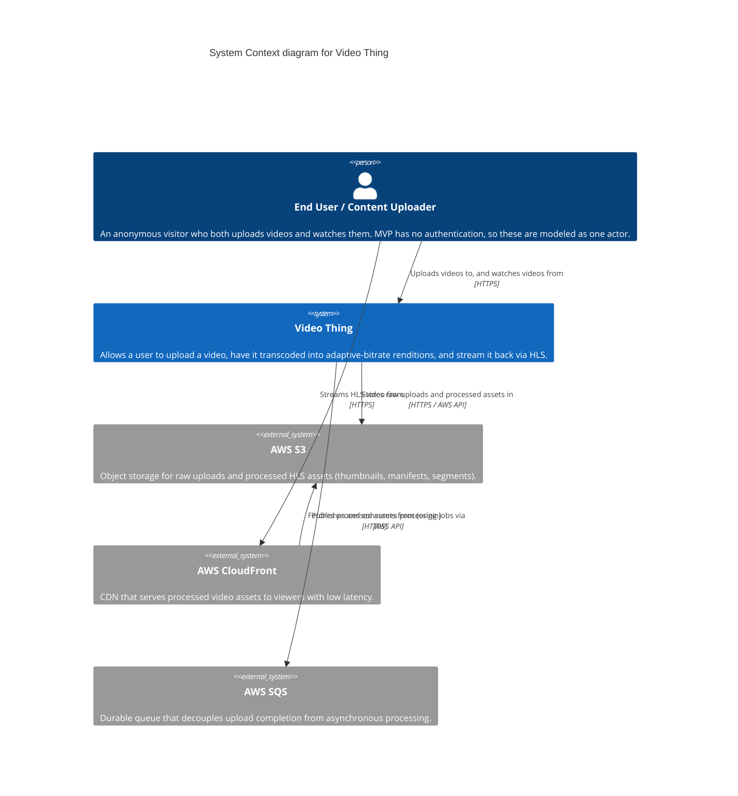
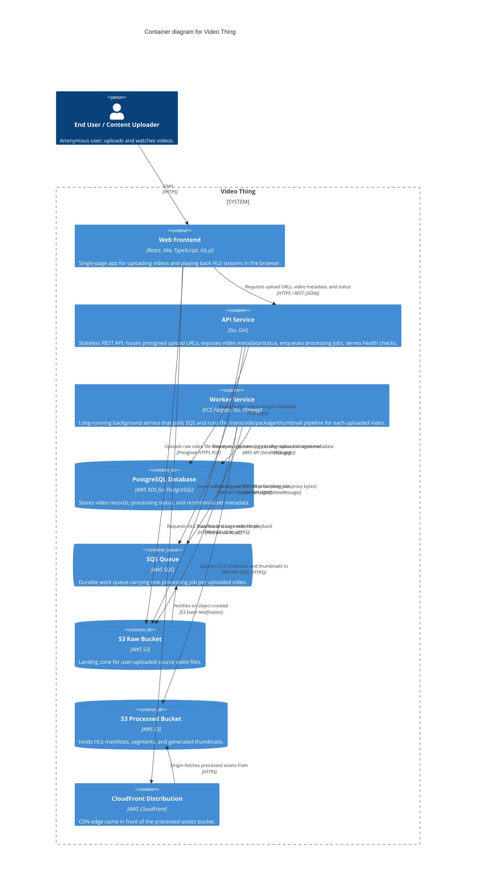
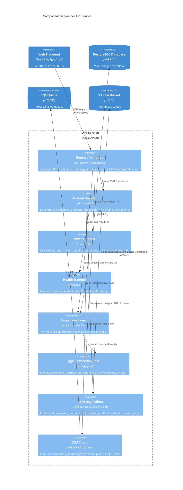
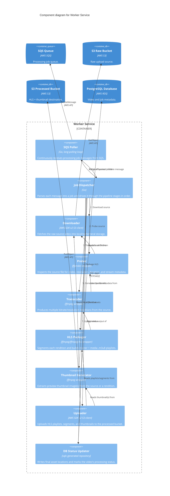

# C4 Model: Video Thing

This document describes the Video Thing architecture using the [C4 model](https://c4model.com/) at three levels of abstraction: System Context, Container, and Component. It reflects the MVP scope of the system: video upload, asynchronous processing (transcoding, packaging, thumbnailing), and HLS playback. Authentication, live streaming, DRM, and analytics are explicitly out of MVP scope and are noted only where they provide useful future context.

---

## Level 1: System Context

The context diagram shows the Video Thing as a single system and the actors and external services that interact with it from the outside.

### Actors

- **End User (viewer)** — watches videos served as HLS streams through CloudFront.
- **Content Uploader** — submits raw video files for processing.

In the MVP, these are **the same actor**. There is no authentication, no accounts, and no authorization model: any visitor can request an upload URL and any visitor can watch any processed video whose ID they have. This is called out explicitly here rather than left implicit, because it is the single biggest simplification in the system's threat model and UX, and it is the first place a reviewer should look when assessing production readiness.

### System purpose

The Video Thing accepts a video file from a user, uploads it directly to object storage, processes it in the background into multiple HLS renditions and thumbnails, and serves the result back through a CDN for adaptive playback. The system boundary here includes the API and worker logic that constitutes "the platform"; S3, CloudFront, and SQS are drawn as external systems because they are managed AWS services the platform depends on and configures, not code the platform team owns or deploys.

### MVP boundary vs. future context

Out of scope for MVP, mentioned here only as future context:

- **Authentication** — would insert as a new external identity provider (e.g., an IdP box) with a `Rel` from the User to it, and the User→Video Thing relationship would carry a bearer token/session cookie instead of being anonymous. It would also introduce an owner concept on uploaded videos, which does not exist today.
- **Live streaming** — would introduce a new ingest protocol (RTMP/SRT) and a separate low-latency delivery path; not modeled here.
- **DRM** — would sit between CloudFront and the viewer (license server interaction) and is not represented.
- **Analytics** — would add an event-collection external system fed by both the frontend player and CloudFront access logs; not represented.

---

## Level 2: Container Diagram

The container diagram zooms into the Video Thing system boundary and shows the deployable/runnable units and the managed AWS services they talk to directly.

### Container responsibilities

- **Web Frontend** — a React/Vite/TypeScript SPA. Requests a presigned upload URL from the API, PUTs the raw file straight to S3, then polls the API for processing status and uses `hls.js` to play the resulting manifest served via CloudFront.
- **API Service** — a stateless Go/Gin REST service. Its only jobs are: mint presigned S3 URLs, persist/read video and job metadata in PostgreSQL, and enqueue processing jobs onto SQS. It never touches video bytes.
- **Worker Service** — an ECS Fargate task running Go orchestration around FFmpeg/ffprobe. It polls SQS, downloads the source, transcodes to multiple renditions, packages HLS, generates thumbnails, uploads results, and updates the database — entirely decoupled from request/response latency.
- **PostgreSQL (RDS)** — the system of record for video and job state, shared (via distinct access patterns) by the API and the worker.
- **SQS Queue** — the sole coupling point between "upload accepted" and "processing happens." Provides durability, retry, and backpressure without the API or worker needing to know about each other.
- **S3 Raw Bucket** — write target for browser uploads and read source for the worker; not routed through the API.
- **S3 Processed Bucket** — write target for the worker and origin for CloudFront; never written to directly by the API or frontend.
- **CloudFront Distribution** — the only path viewers use to fetch HLS assets; caches at the edge and shields the processed bucket from direct public access.

### Key design principles

- **Never proxy uploads through the API.** The API's role in the upload path is limited to authorizing (implicitly, given no-auth MVP) and generating a presigned PUT URL. The actual file bytes flow browser → S3 directly. This keeps the API stateless, avoids buffering large files in application memory, and lets upload throughput scale independently of API capacity.
- **The worker never blocks the API.** The API's synchronous responsibility ends the moment a job is placed on SQS. Transcoding is CPU- and time-intensive (minutes, not milliseconds); SQS is the boundary that lets the worker fail, retry, and scale (via Fargate task count) without any HTTP request ever waiting on FFmpeg.

---

## Level 3: Component Diagrams

### API Service — Components

**Request flow (upload):** `spa` → `router` → `uploadHandler`, which calls `presignClient` to mint a scoped, time-limited PUT URL, calls `repo` (backed by `pgPool`) to persist a `pending` video row, and calls `sqsClient` to publish the job — all before returning the presigned URL to the browser, which then uploads directly to `s3raw`.

**Request flow (status/playback):** `spa` → `router` → `videoHandler` → `repo` → `pgPool` → `db`, returning current processing status and, once complete, the CloudFront URL of the HLS manifest.

The API is intentionally thin: the `Router/Handlers` layer does no business logic beyond binding/validation, handlers delegate all persistence to the `sqlc`-generated `Repository Layer` (compile-time-checked SQL, no ORM), and the `pgx` pool is the single shared resource injected into every handler that needs data access. The `S3 Presign Client` and `SQS Client` are the only two points where the API touches AWS services directly, and both are narrow, single-purpose wrappers — the API never opens a data-plane connection to S3 for object bytes.

### Worker Service — Components

**Pipeline flow (matches processing order):** the `SQS Poller` long-polls `queue` and hands each message to the `Job Dispatcher`, which drives a strict, ordered pipeline: **(1) Download** the source via the `Downloader`; **(2) Probe** it with the `Prober` (ffprobe) to extract codec/resolution/duration; **(3) Transcode** multiple renditions with the `Transcoder` (ffmpeg) using the probe output to pick sane encode parameters; **(4) Package HLS** by segmenting each rendition and generating master/media playlists via the `HLS Packager`; **(5) Generate thumbnails** from the source with the `Thumbnail Generator`; **(6) Upload** all resulting playlists, segments, and thumbnails to `s3processed` via the `Uploader`; **(7) Update DB** status and asset paths via the `DB Status Updater`; and only **(8) after every prior stage succeeds**, the dispatcher signals the poller to delete the SQS message.

This strict ordering and the deliberate placement of `DeleteMessage` as the last step are the key reliability decisions in the worker: if the process crashes or any stage fails partway through, the message becomes visible again after the visibility timeout and the whole job is retried from scratch rather than being lost or silently half-completed. Each component wraps a single external tool or AWS API surface (ffprobe, ffmpeg, S3, SQS, Postgres) so failures are isolated and attributable to a specific pipeline stage, which is also where future work like partial-failure handling or per-stage retries would be inserted without touching the API.
