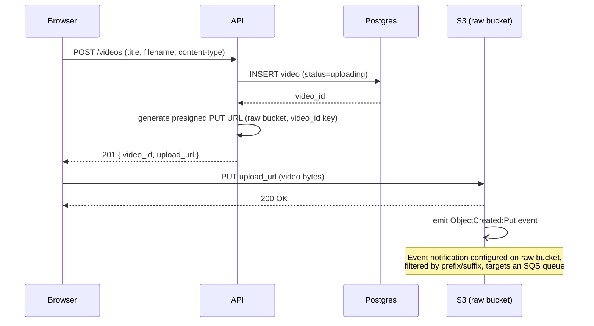
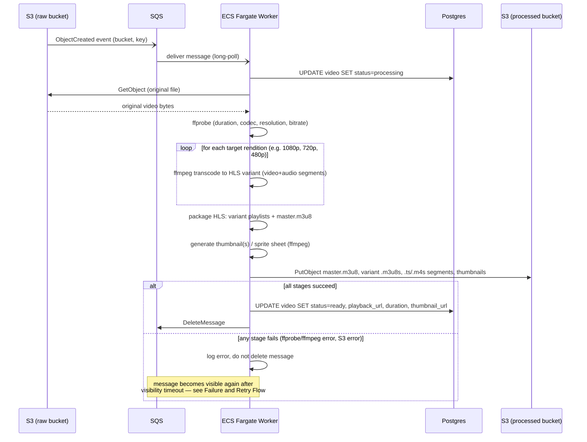
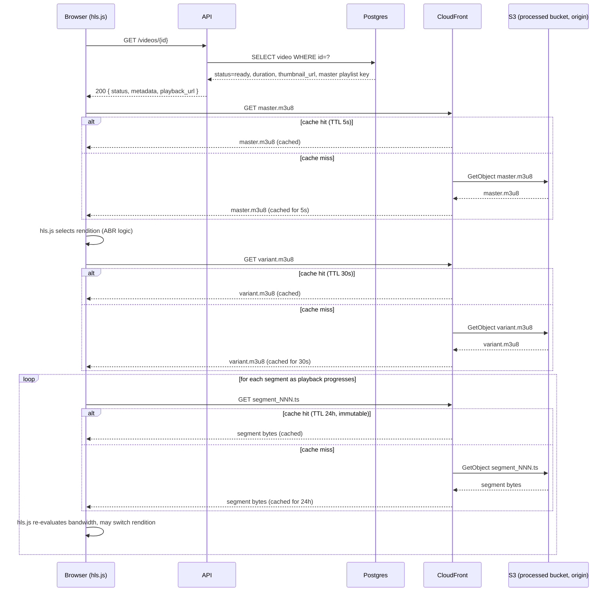

# Sequence Diagrams

This document captures the four core request/event flows in the platform: upload, asynchronous processing, playback, and failure/retry handling. Each diagram reflects the MVP architecture: a Go/Gin API, PostgreSQL for state, S3 for object storage (separate raw and processed buckets), SQS for decoupling upload events from processing, an ECS Fargate worker running FFmpeg, and CloudFront as the playback CDN in front of the processed bucket.

## Upload Flow

The API never proxies file bytes. Instead it issues a presigned S3 URL and lets the browser PUT directly to S3, which keeps large uploads off the API's compute and network path entirely — Fargate/Gin containers stay stateless and cheap, and upload throughput isn't bounded by API instance count or timeout settings. The DB row is created with `status=uploading` before the presigned URL is even returned, so the video has a durable identity (and the frontend has something to poll/render) before any bytes exist in S3. S3's `ObjectCreated` event notification is the trigger that hands off to the async pipeline — the API has no further involvement once it returns the presigned URL; it does not "watch" the upload.



The presigned URL is scoped to a single object key (typically `{video_id}/original.<ext>`) and expires quickly, limiting the blast radius if it leaks. Because the event notification — not the browser's PUT response — is the source of truth for "upload finished," a client that dies mid-upload simply never triggers processing, and the row stays in `uploading` (a background sweeper can later expire stale ones).

## Processing Flow

This is where SQS earns its place: it decouples a bursty, unreliable event source (S3 notifications, arbitrary upload sizes) from a pool of Fargate workers that can scale independently and process messages at their own pace. The worker pipeline is deliberately linear and idempotent-per-stage so that a retry (see Failure and Retry Flow) can re-run safely: download, probe, transcode each rendition, package HLS, generate thumbnails, upload, then update Postgres. The SQS message is only deleted after the DB is durably updated to `Ready` — this ordering is what makes at-least-once delivery safe, since a crash before the DB write simply causes redelivery rather than a lost job.



Transcoding is modeled as a loop over renditions rather than a single ffmpeg invocation per output so that a partial failure (e.g. the 480p pass succeeds but 720p OOMs the container) is visible at the stage level — useful both for logging/metrics and for deciding whether a future version should support partial-rendition retries. Thumbnails are generated after transcoding but before upload so a single `PutObject` batch writes the complete asset set, avoiding a window where playback assets exist without a poster image.

## Playback Flow

The API is only in the metadata path, never the media path: it returns the video's status, duration, and the master playlist URL once, and then steps out of the way entirely. hls.js does all subsequent fetching (master playlist, then the variant playlist for the bitrate it selects, then individual segments) and all adaptive bitrate switching client-side by re-evaluating throughput and buffer health — the API is not consulted per segment or per rendition switch. CloudFront sits in front of the processed bucket as a caching layer with TTLs tuned per asset type: the master playlist gets a 5s TTL because it rarely changes but should reflect a `Ready` status flip quickly if a viewer loads the page moments after processing finishes; variant playlists get 30s since they're mostly static for VOD content; and segments get a 24h TTL because segment filenames are content-addressed/immutable (a new transcode produces new keys), so aggressive caching carries no staleness risk.



Note that a rendition switch does not involve the API or Postgres at all — it's just hls.js issuing a `GET` for a different variant playlist against the same CloudFront distribution, which is what makes ABR scale to arbitrary concurrent viewers without adding API load.

## Failure and Retry Flow

SQS visibility timeout is the mechanism that turns worker crashes into automatic retries without any custom heartbeat/lease code: when a worker receives a message, it becomes invisible to other consumers for the duration of the visibility timeout, but if the worker dies or hangs before calling `DeleteMessage`, the message simply reappears in the queue once that timeout elapses — no explicit failure signal is required. The visibility timeout must be set comfortably longer than the worst-case transcode time (or the worker should heartbeat-extend it), otherwise a slow-but-healthy job gets redelivered and processed twice. After `maxReceiveCount` redeliveries, SQS's redrive policy moves the message to a Dead Letter Queue automatically, which is what bounds the retry storm — without a DLQ, a poison-pill message (e.g. a corrupt upload that always crashes ffprobe) would loop forever, burning Fargate capacity.

```mermaid
sequenceDiagram
    participant SQS
    participant Worker as ECS Fargate Worker
    participant Postgres
    participant DLQ as Dead Letter Queue

    loop retry attempt, up to maxReceiveCount
        SQS-)Worker: deliver message (receive count += 1)
        Worker->>Postgres: UPDATE video SET status=processing
        Worker->>Worker: begin transcode pipeline

        alt worker crashes or ffmpeg fails
            Note over Worker: process dies / exception thrown /<br/>container OOM-killed before DeleteMessage
            Note over SQS: message stays invisible until<br/>visibility timeout expires
            SQS->>SQS: visibility timeout expires, message becomes visible again
        else pipeline succeeds
            Worker->>Postgres: UPDATE video SET status=ready
            Worker->>SQS: DeleteMessage
            Note over SQS,Worker: loop exits, no further retries needed
        end
    end

    alt receive count exceeds maxReceiveCount
        SQS->>DLQ: move message (redrive policy)
        Note over DLQ: message preserved for inspection;<br/>original queue no longer redelivers it
        Worker->>Postgres: UPDATE video SET status=failed
        Note over Postgres,DLQ: worker (or a separate DLQ processor)<br/>sets terminal Failed status and may<br/>trigger an alarm/notification (e.g. CloudWatch alarm on DLQ depth)
    end
```

Setting `status=failed` is treated as a distinct, deliberate action rather than something inferred from the message reaching the DLQ implicitly — this keeps the DB and the queue as two independently reconciled sources of truth, and makes it possible to build an operator-facing alarm (e.g. CloudWatch alarm on `ApproximateNumberOfMessagesVisible` for the DLQ) that fires purely off queue depth, independent of whether the DB write path is healthy.
