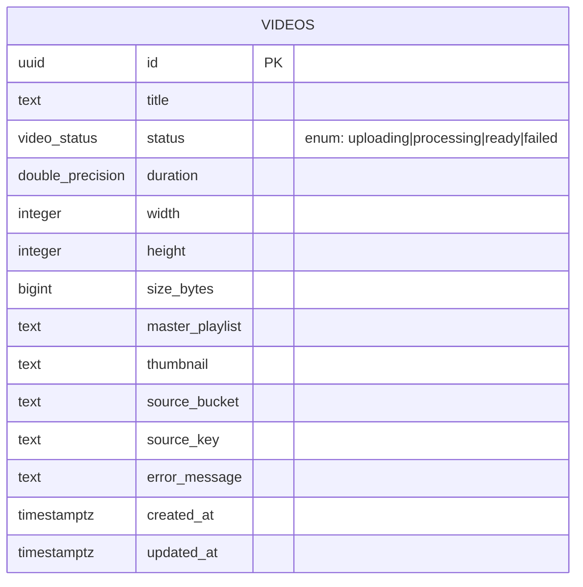

# Database Schema Specification

## Status

MVP — v1 of the schema, covering the `videos` table only.

## Scope

This document specifies the PostgreSQL schema backing the video platform MVP: the
upload → transcode → publish lifecycle of a single video asset. It covers the `videos`
table itself, the reasoning behind key modeling decisions (status representation,
timestamps, indexing), the migration tooling convention (`golang-migrate`), and how
migrations are expected to run in CI/CD. It intentionally does **not** design
per-rendition tracking, users, playback analytics, or any other future table — those
are called out only as forward-looking notes so today's schema doesn't need to be
revisited to accommodate them structurally.

## The `videos` table

`videos` is the single source of truth for an uploaded asset and its processing
state. One row is created the moment an upload is registered (before any bytes are
necessarily transcoded), and the same row is updated in place as the asset moves
through the pipeline.

| Column            | Type               | Nullable | Default             | Purpose |
|--------------------|--------------------|----------|----------------------|---------|
| `id`               | `uuid`             | no       | `gen_random_uuid()`  | Primary key. UUIDs are used instead of a serial/identity integer so IDs can be generated client-side or by the API before the row is persisted (useful for pre-signing upload URLs keyed by the future video ID), and so IDs don't leak sequential volume information. |
| `title`            | `text`             | no       | —                    | User-facing display name. |
| `status`           | `video_status` (enum) | no    | `'uploading'`        | Pipeline state. See [Status modeling](#status-modeling-enum-vs-check-constraint) below. |
| `duration`         | `double precision` | yes      | —                    | Playback duration in seconds. Unknown until the worker has probed the source file, hence nullable. |
| `width`            | `integer`          | yes      | —                    | Source resolution width in pixels. Nullable for the same reason as `duration`. |
| `height`           | `integer`          | yes      | —                    | Source resolution height in pixels. |
| `size_bytes`       | `bigint`           | yes      | —                    | Size of the source upload in bytes. `bigint` because video files routinely exceed the 2^31 byte (~2 GB) range that an `integer` supports. |
| `master_playlist`  | `text`             | yes      | —                    | Object storage key/URL of the HLS/DASH master playlist. Null until transcoding completes successfully. |
| `thumbnail`        | `text`             | yes      | —                    | Object storage key/URL of the generated thumbnail. Null until generated. |
| `source_bucket`    | `text`             | no       | —                    | Bucket the original upload lives in. Required at creation time — the worker needs this to know where to fetch the source object from. |
| `source_key`       | `text`             | no       | —                    | Object key of the original upload within `source_bucket`. Required at creation time for the same reason as `source_bucket`. |
| `error_message`    | `text`             | yes      | —                    | Populated when `status = 'failed'`, holding a human-readable failure reason for operator debugging. Left null in all other states. |
| `created_at`       | `timestamptz`      | no       | `now()`              | Row creation time; also the natural "recency" sort key for listing views. |
| `updated_at`       | `timestamptz`      | no       | `now()`              | Last-modified time; kept current automatically — see [`updated_at` maintenance](#updated_at-maintenance). |

`source_bucket` and `source_key` are modeled as separate, required, non-null columns
rather than a single combined URI so the worker can address the object storage SDK
(bucket + key) directly without string parsing, and so the two can be indexed or
queried independently if a future migration needs to (e.g., "find all videos sourced
from bucket X" during a bucket migration).

### Status modeling: enum vs. check constraint

`status` is modeled as a native PostgreSQL enum type (`video_status`), not a `text`
column with a `CHECK` constraint. Both approaches were considered explicitly because
of how they interact with `golang-migrate`'s migration model.

**Why an enum, not a `text` + `CHECK`:**

- **Correctness by construction.** An enum makes invalid states unrepresentable at
  the type level — the database itself rejects `'compelted'` or `'READY'` at
  `INSERT`/`UPDATE` time, rather than relying on every writer to remember to match a
  `CHECK`'s exact string list. This matters more as more services (API, worker,
  future admin tooling) write to this table over time.
- **Self-documenting schema.** `\d video_status` (or any schema introspection tool)
  lists the exact legal values in one place, independent of the table definition.
- **Storage/comparison cost.** An enum value is stored and compared as a 4-byte
  ordinal internally, versus a variable-length `text` value — a minor win here, but
  free.

**The `golang-migrate` consideration, and how it's handled:**

The prompt for this design explicitly calls out that new enum values must be
addable later *without a full table rewrite*. This is true of PostgreSQL enums —
`ALTER TYPE video_status ADD VALUE 'archived'` is a fast, catalog-only operation; it
does not rewrite the table's rows or scan them for validation, unlike, say, growing a
`CHECK (status IN (...))` constraint via `ALTER TABLE ... ADD CONSTRAINT`, which does
require PostgreSQL to scan and validate every existing row against the new
constraint (unless done in two steps with `NOT VALID` + a later `VALIDATE
CONSTRAINT`, adding operational complexity).

The catch is transactional: PostgreSQL does not allow a newly added enum value to be
used in the same transaction that added it (`ALTER TYPE ... ADD VALUE` commits the
new label only at transaction end in older server versions, and even on modern
servers a new label cannot be referenced before that transaction commits). Since
`golang-migrate`'s Postgres driver runs each `.up.sql` file inside its own
transaction by default, this means:

- A migration that adds an enum value **must not**, in the same file, also `INSERT`
  or `UPDATE` a row using that new value. Do the `ALTER TYPE ... ADD VALUE
  IF NOT EXISTS` in its own dedicated, single-statement migration file, and consume
  the new value only in a later migration (or later application code), never in the
  same transaction.
- PostgreSQL has no `ALTER TYPE ... DROP VALUE`. There is no clean way to remove an
  enum label once added without recreating the type (rename old type, create new
  type with the reduced value set, rewrite the column, drop the old type). Any
  migration that adds a `video_status` value should therefore be treated as
  effectively forward-only: its paired `.down.sql` cannot cleanly reverse the `ADD
  VALUE` and should say so explicitly in a comment (a true down would require the
  full type-recreation dance above, which is out of scope unless actually needed).

This is a deliberate, documented tradeoff: enums buy correctness and avoid
row-rewrite costs on the common path (adding a new status), at the cost of a small
amount of process discipline when writing that specific class of future migration.
For an MVP with a stable four-value status set (`uploading`, `processing`, `ready`,
`failed`), this is judged the right trade versus a `CHECK` constraint, which avoids
the transactional gotcha entirely but pays a full-table validation scan on every
future value addition and provides weaker guarantees in the meantime.

### Indexes

Two indexes back the query patterns the MVP is known to need:

```sql
CREATE INDEX idx_videos_status ON videos (status);
CREATE INDEX idx_videos_created_at ON videos (created_at DESC);
```

- `idx_videos_status` — the transcoding worker polls for videos in a given state
  (e.g., `status = 'uploading'` to pick up new work, `status = 'processing'` for
  stuck-job detection), and an operator dashboard filters/counts by status. Both are
  low-cardinality equality lookups that benefit directly from a B-tree index on
  `status`.
- `idx_videos_created_at` — the primary listing view ("recently uploaded videos")
  sorts by recency. The index is declared `DESC` since that's the scan order the
  listing query actually uses (`ORDER BY created_at DESC LIMIT ...`), letting
  PostgreSQL satisfy the sort from the index without a separate sort step.

`id` is already indexed implicitly via the `PRIMARY KEY` constraint and needs no
additional index.

A composite index on `(status, created_at DESC)` was considered but deliberately
deferred — with a single table and MVP-scale data volume, two single-column indexes
are simpler to reason about and sufficient; a composite index is an easy follow-up
migration if a specific query plan later shows it's needed.

### `updated_at` maintenance

Rather than relying on every write path (API, worker) to remember to set
`updated_at = now()` on every `UPDATE`, this is enforced at the database level with
a `BEFORE UPDATE` trigger:

```sql
CREATE OR REPLACE FUNCTION set_updated_at()
RETURNS TRIGGER AS $$
BEGIN
    NEW.updated_at := now();
    RETURN NEW;
END;
$$ LANGUAGE plpgsql;

CREATE TRIGGER videos_set_updated_at
    BEFORE UPDATE ON videos
    FOR EACH ROW
    EXECUTE FUNCTION set_updated_at();
```

The function is written generically (it does not reference the `videos` table by
name) so it can be reattached to future tables via a `CREATE TRIGGER ... EXECUTE
FUNCTION set_updated_at()` one-liner, rather than duplicating the same three lines
of PL/pgSQL per table. This is the convention going forward: any new table with an
`updated_at` column gets its own `BEFORE UPDATE ... EXECUTE FUNCTION
set_updated_at()` trigger in its creating migration, reusing this one function.

This approach was chosen over "application sets `updated_at` on every write" because
it's impossible to forget, it's correct even for `UPDATE` statements issued directly
against the database (migrations, manual ops fixes, future services), and it keeps
`updated_at` meaningfully distinct from `created_at` without spreading that
responsibility across every calling service.

## Migration strategy

Migrations are managed with [`golang-migrate`](https://github.com/golang-migrate/migrate),
following its standard file-based convention:

- Files live under `packages/database/migrations/` (see
  `../../packages/database/migrations/000001_create_videos_table.{up,down}.sql`
  for the reference migration) and are named:

  ```
  {version}_{description}.up.sql
  {version}_{description}.down.sql
  ```

  `{version}` is a zero-padded, strictly increasing sequence number (`000001`,
  `000002`, ...), not a timestamp — sequence numbers make migration ordering
  unambiguous at a glance and avoid clock-skew issues across contributors' machines.
  `{description}` is a short, snake_case summary of what the migration does (e.g.,
  `create_videos_table`).

- **Every migration must be reversible.** Each `.up.sql` file has a matching
  `.down.sql` that undoes exactly what the `.up.sql` did, in reverse dependency
  order (drop triggers before the functions they call, drop tables before the types
  their columns depend on, etc.). A migration without a working `down` is not
  accepted — it removes the team's ability to roll back a bad deploy. (The one
  documented exception is the enum-`ADD VALUE` case described above, where PostgreSQL
  itself doesn't support a true reversal; that limitation is called out in the
  migration file's comments rather than silently omitted.)

- **Migrations run via the `migrate` CLI**, not application code:

  ```sh
  migrate -path db/migrations -database "$DATABASE_URL" up
  ```

  and to roll back the most recent migration:

  ```sh
  migrate -path db/migrations -database "$DATABASE_URL" down 1
  ```

### CI/CD integration

Migrations run as an explicit, separate step in the deploy pipeline — never as a
side effect of starting the API or worker process:

1. CI builds and tests the API/worker images as usual.
2. As a deploy step, **before** the new API/worker version is rolled out, the deploy
   pipeline runs `migrate -path db/migrations -database "$DATABASE_URL" up` against
   the target environment's database, using a short-lived credential scoped to
   schema changes.
3. Only once that step exits `0` does the pipeline proceed to deploy the new
   API/worker image(s).
4. If the migration step fails, the deploy pipeline halts before any new code is
   rolled out — the old API/worker version keeps running against the old (still
   compatible) schema.

Application code **never** auto-migrates on boot. Letting a horizontally-scaled API
or worker fleet run migrations on startup means multiple instances can race to
apply the same migration concurrently during a rolling deploy, and it couples
schema changes to application restarts/crash-loops in a way that's hard to reason
about and impossible to gate on a health check. Running migrations as their own
pipeline step, ordered strictly before the new code deploys, keeps schema and code
rollout decoupled, auditable (a distinct CI log/step), and safe to retry
independently of application deploys.

This also implies a working convention for backward-compatible schema changes: a
migration that a not-yet-deployed new code version depends on (e.g., a new required
column) should be split into an additive migration that ships and runs *before* the
code that depends on it, so the old code version keeps working unmodified against
the newly-migrated schema for the duration of the rollout.

## Entity-relationship diagram



For the MVP, `videos` is the entire schema. The commented note above documents where
the schema is expected to grow — a `video_renditions` table keyed by `video_id`
foreign key, once per-rendition (e.g., per-resolution) encoding status needs its own
row — without committing to that design prematurely.
